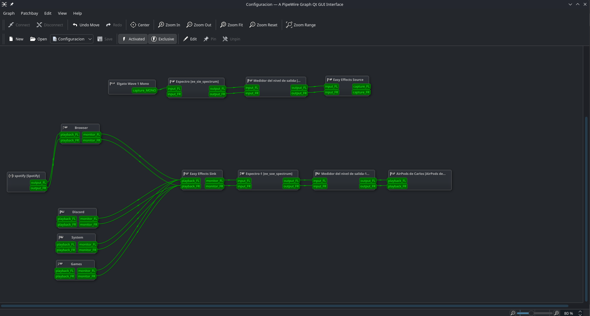

# Configuración de Audio

## Explicación express
A día que escribo esto (10-03-26) yo utilizo como micrófono un Wave:1, por lo que el software por defecto en Windows me deja "dividir" los canales para que las apps vayan a distintas fuentes y tenga un control completo de estos.

Así que decidí replicarlo en Linux, únicamente lo haré de 4 canales.

## Canales

| Canal | Propósito |
| :--- | :--- |
| **System** | Alertas de Bazzite, notificaciones y sonidos generales. |
| **Browser** | Aunque se llame Browser, también metí a Spotify ya que suelo escucharlo al mismo nivel que lo que veo en el navegador. |
| **Games** | Audio directo de Steam, Lutris o emuladores. |
| **Discord** | Su propio nombre lo dice pero, exclusivamente para la app de Discord. |

### 1. Preparación de Software
Antes de comenzar, instala las herramientas necesarias desde **Bazaar** (la tienda de apps de Bazzite):
* **qpwgraph**: Para el ruteo visual de cables.
* **Easy Effects**: Para el post-procesamiento y ecualización.

### 2. El Script de Creación
Recomiendo guardar tus scripts en una carpeta dedicada. En mi caso utilizo `~/Scripts-Config/`.

En esta misma carpeta también guardaré el archivo de configuración de qpwgraph. Pero eso lo explicaré más adelante.

1. Haz clic derecho y da clic en la opción de "abrir terminal aqui"
2. Escribe lo siguiente:
```bash
nano mis-canales.sh
```
3. Escribe el sig. script:

```bash
#!/bin/bash
# 1. Esperar a que PipeWire y el sistema de archivos estén listos
sleep 5

# 2. Crear canales virtuales (Sinks)
pactl load-module module-null-sink sink_name=System sink_properties=device.description=System
pactl load-module module-null-sink sink_name=Discord sink_properties=device.description=Discord
pactl load-module module-null-sink sink_name=Games sink_properties=device.description=Games
pactl load-module module-null-sink sink_name=Browser sink_properties=device.description=Browser

echo "Canales de audio creados exitosamente."

# 3. Lanzar qpwgraph con ruta absoluta de Bazzite y activación forzada
# Usamos 'flatpak run' para asegurar que use el entorno correcto si es la versión de la tienda
flatpak run org.rncbc.qpwgraph -a "/var/home/werta/Scripts-Config/Configuracion.qpwgraph" > /dev/null 2>&1 & 
```
**Cambia la ruta donde dice werta al nombre de usuario que tengas configurado.**

4. Oprime Ctrl+O, Enter y luego Ctrl+X
5. Da permisos de ejecución con el siguiente comando:
```bash
chmod +x mis-canales.sh
```
6. Agrega este archivo al autoarranque en: Preferencias del sistema > Inicio automático > + añadir nuevo > Aplicación > Abrir diálogo de archvo (icóno a la derecha de donde puedes escribir) > **Aquí escoge el archivo .sh** > Abrir.

De esta manera ya esta configurado el archivo para que se inicie cada que se prenda la PC.

### 3. Configuración de qpwgraph. 

> **Nota:** Aunque configurar los cables manualmente es tedioso, solo se hace una vez si guardas la sesión correctamente.

1. Abre **qpwgraph** y localiza tu audio principal (en mi caso son unos Airpods 3).
2. Conecta los nodos de salida de tus canales virtuales (**System, Games, etc.**) a los nodos de entrada de tu audio principal.
> **Nota:** Siempre que hagas algun cambio **GUARDALO**, en mi caso lo guardo en la carpeta mencionada anteriormente. 


**Nota** Asegurate que siempre tengas las opciones de **Exclusive** y **Activated** activadas, de esta manera te ahorraras muchos dolores de cabeza.

### 4. Configuración de Easy Effects.
**Seccion en prograso**
